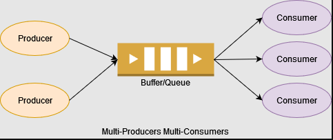
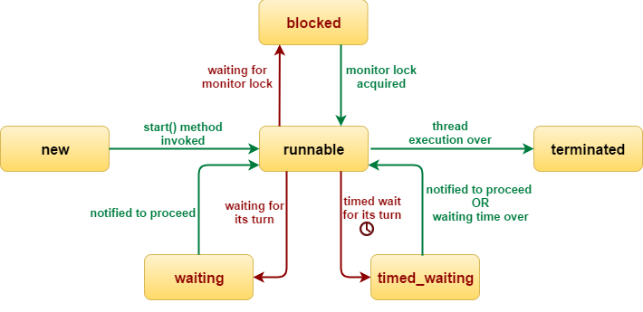
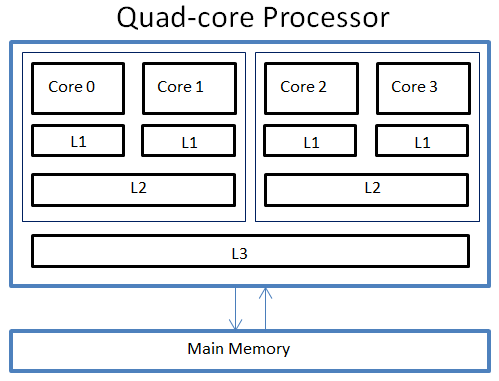
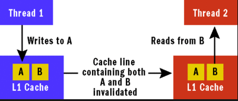
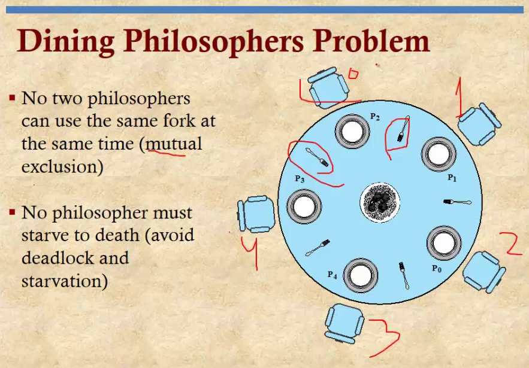

# Concurrency Basics

> This is a tutorials course covering concurrency basics in Java.

Tools used:

- JDK 11
- Maven
- JUnit 5, Mockito
- IntelliJ IDE

## Table of contents

1. [Introduction to Concurrency](https://github.com/backstreetbrogrammer/25_Concurrency#chapter-01-introduction-to-concurrency)
    - [Threading fundamentals](https://github.com/backstreetbrogrammer/25_Concurrency#threading-fundamentals)
    - [Thread coordination](https://github.com/backstreetbrogrammer/25_Concurrency#thread-coordination)
2. [Ordering read and write operations](https://github.com/backstreetbrogrammer/25_Concurrency#chapter-02-ordering-read-and-write-operations)
    - [Synchronization and Visibility](https://github.com/backstreetbrogrammer/25_Concurrency#synchronization-and-visibility)
    - [Java Memory Model](https://github.com/backstreetbrogrammer/25_Concurrency#java-memory-model)
    - [False Sharing](https://github.com/backstreetbrogrammer/25_Concurrency#false-sharing)
    - [Singleton design pattern](https://github.com/backstreetbrogrammer/25_Concurrency#interview-problem-7-jp-morgan-chase-merrill-lynch-goldman-sachs-singleton-design-pattern)

---

### Chapter 01. Introduction to Concurrency

#### Threading fundamentals

In computer science, **concurrency** is the execution of the multiple instruction sequences at the **same** time.

In more technical terms, **concurrency** is the ability of different parts or units of a program, algorithm, or problem
to be executed out-of-order or in partial order, without affecting the outcome. This allows for **parallel** execution
of the concurrent units, which can significantly improve overall speed of the execution in multiprocessor and multicore
systems. It may also refer to the _decomposability_ of a program, algorithm, or problem into order-independent or
partially-ordered components or units of computation.

- Case 1: CPU with only one core

CPU will be executing processes one by one, individually by **time slice**. A time slice is short time frame that gets
assigned to process for CPU execution.

- Case 2: CPU with multiple cores

Only on multicore CPU system, multiple processes execute at the **same** time on different cores.

**Scheduler**

CPU Scheduling is a process that allows one process to use the CPU while another process is delayed (in standby) due to
unavailability of any resources such as I/O etc., thus making full use of the CPU. Whenever the CPU becomes idle, the
operating system must select one of the processes in the line ready for launch. The selection process is done by a
temporary (CPU) scheduler. The Scheduler selects between memory processes ready to launch and assigns the CPU to one of
them.

Scheduler may **pause** a thread due to:

- The thread is waiting for some more data
- The thread is waiting for another thread to do something
- CPU should be shared equally among threads

**What is a Java Thread?**

We can define threads as a light-weight **subprocess** within the smallest unit of **processes** and having separate
paths of execution. These threads use shared memory, but they act independently. Hence, if there is an exception in a
thread, that will not affect the working of other threads despite them sharing the same memory.

Few points about Java Thread:

- Thread is a set of instructions defined at Operating System level
- Lightweight sub-process through which we can perform multiple activities within a single process
- An application can be composed of several threads => JVM itself works with several threads like GC, JIT, etc.
- Different threads can be executed at the **same** time on different cores or cpus

**Race Condition**

By definition, a race condition is a condition of a program where its behavior depends on relative timing or
interleaving of multiple threads or processes.

In simpler words, it means that two different threads are trying to **read** and **write** the **same** variable at
the **same** time.

#### Interview Problem 1 (Macquarie, Merrill Lynch): Demonstrate race condition in Singleton pattern and how to fix it

Given source code for Singleton pattern:

```java
public class SingletonDemo {

    private static SingletonDemo instance;

    private SingletonDemo() {
    }

    public static SingletonDemo getInstance() {
        if (instance == null) {
            instance = new SingletonDemo();
        }
        return instance;
    }

}
```

Explanation for **race condition**:

Suppose there are 2 threads `T1` and `T2` calling `getInstance()` method at the same time.

- `T1` thread gets CPU time and reaches at point: `if (instance == null)`
- The thread scheduler pauses `T1`
- `T2` thread gets CPU time, and it passes this line of code and creates new instance: `instance = new SingletonDemo()`
- The thread scheduler pauses `T2`
- `T1` thread gets CPU time, and it resumes from `if (instance == null)` check: it will also create a new
  instance: `instance = new SingletonDemo()`; thus breaking the Singleton pattern contract.

**Solution**:

Use **synchronization**.

Synchronization prevents a block of code to be executed by more than one thread at the same time.

```java
public class SingletonDemo {

    private static SingletonDemo instance;

    private SingletonDemo() {
    }

    public static synchronized SingletonDemo getInstance() {
        if (instance == null) {              // read
            instance = new SingletonDemo();  // write
        }
        return instance;
    }

}
```

For synchronization to work, we need a synchronization object key also called as monitor or mutex - every Java object
can play as monitor or mutex.

In the `static` method context => Class object is synchronization object key

```
// SingletonDemo.class => synchronization object key
public static synchronized SingletonDemo getInstance() {
   ...
}
```

In the `non-static` method context => instance object is synchronization object key

```
// instance object which invokes this method is synchronization object key
public synchronized SingletonDemo getInstance() {
   ...
}
```

Or, we can also explicitly use a Java object as synchronization object key using **synchronized block**

```
// instance object used explicitly as synchronization object key in synchronized block
public SingletonDemo getInstance() {
   synchronized(this) {
     ...
   }
}
```

Another solution is that somehow we can segregate read / write logic so that one thread writes the object synchronously
and after that, all the subsequent reads do not require any locking or synchronization.

```java
public class SingletonDemo {

    // write once when the class is initialized - always thread safe 
    private static SingletonDemo instance = new SingletonDemo();

    private SingletonDemo() {
    }

    public static SingletonDemo getInstance() {
        return instance; // no lock required for reads by multiple threads
    }

}
```

When the class loader loads the `SingletonDemo` class, **instance** object is created at that time. Thus, further
subsequent calls to `getInstance()` method during application run will always be thread safe and don't require any lock.

**Reentrant Lock**

Java locks are **reentrant** => when a thread holds a lock, it can enter a block synchronized on the lock it is holding.

```
public synchronized SingletonDemo getInstance() {
   ...
}

public synchronized void doSomething() {
   ...
}
```

A thread `T1` which has acquired instance lock by entering the `getInstance()` method can also enter `doSomething()`
method as the instance lock is same for both the methods. Any other thread can **not** acquire the instance lock and
enter these 2 methods as it's held by thread `T1`.

**Deadlock**

A deadlock is a situation where a thread `T1` holds a key needed by a thread `T2`, and `T2` holds the key needed by
`T1`. In this situation, both the threads will keep on waiting for each other indefinitely.

There is nothing we can do if the deadlock situation happens but to restart the JVM. However, even identifying a
deadlock is very complex in the modern JVMs or monitoring tools.

**How to create and run threads in Java?**

The most basic way is to:

- create a `Runnable` instance
- pass it to the `Thread` constructor
- invoke `start()` method on `Thread` object

**Example source code**:

```java
public class CreateThreadDemo {

    public static void main(final String[] args) {
        final Runnable runnable = () -> System.out.printf("I am running in this thread: %s%n",
                                                          Thread.currentThread().getName());
        final Thread thread = new Thread(runnable, "MyThread");
        thread.start();
    }

}
```

**Output**:

```
I am running in this thread: MyThread
```

#### Interview Problem 2 (JP Morgan Chase): Demonstrate synchronization issue and fix the code

Given Java Code:

```java
public class Counter {

    private long counter;

    public Counter(final long counter) {
        this.counter = counter;
    }

    public long getCounter() {
        return counter;
    }

    public void increment() {
        counter += 1L;
    }

}
```

```java
public class RaceConditionDemo {

    public static void main(final String[] args) throws InterruptedException {
        final Counter counter = new Counter(0L);
        final Runnable r = () -> {
            for (int i = 0; i < 1_000; i++) {
                counter.increment();
            }
        };

        final Thread[] threads = new Thread[1_000];
        for (int i = 0; i < threads.length; i++) {
            threads[i] = new Thread(r);
            threads[i].start();
        }

        for (int i = 0; i < threads.length; i++) {
            threads[i].join();
        }

        System.out.printf("Counter Value = %d%n", counter.getCounter());
    }

}
```

- What is the output of the counter value?
- Is the output going to be consistent for every run? If not, what is the issue?
- If any race condition, fix the code

**Solution**:

There is a race condition at `counter.increment()` as 1000 threads are trying to mutate the same variable `counter`
at the **same** time.

The output of the value will be different for each run.

Sample Outputs on 4 runs:

```
Counter Value = 994678
Counter Value = 994715
Counter Value = 995232
Counter Value = 980564
```

We need to synchronize the `increment()` method or synchronize the access to `counter` variable.

```
    public synchronized void increment() {
        counter += 1L;
    }
```

After synchronizing the `increment()` method, sample output on 4 runs:

```
Counter Value = 1000000
Counter Value = 1000000
Counter Value = 1000000
Counter Value = 1000000
```

However, still there is a subtle bug in the solution, and it **may** fail in multicore multithreaded environment.
Besides, synchronizing the `increment()` method, we also need to synchronize the `getCounter()` method. Because we need
to guarantee that every **read** is synchronized with latest **writes**, i.e. if any **read** of `counter` variable is
done - it should always happen after the latest **write** by a thread on the `counter` variable. This is called
**"happens-before"** relationship which we will learn later in next chapters.

Complete correct solution:

```java
public class Counter {

    private long counter;

    public Counter(final long counter) {
        this.counter = counter;
    }

    public synchronized long getCounter() { // read
        return counter;
    }

    public synchronized void increment() { // write
        counter += 1L;
    }

}
```

Also in advanced section of this course, we will learn to avoid explicit synchronization and just **atomic** classes to
achieve thread safety. For ex, in the above solution code - if we just make `counter` variable as `AtomicLong`, we do
not need to mark `getCounter()` and `increment()` as synchronized and can use special methods of `AtomicLong` to achieve
thread safety.

#### Interview Problem 3 (Goldman Sachs): Demonstrate deadlock issue and fix the code

Write a program to demonstrate deadlock issue where a thread `T1` holds a key needed by a thread `T2`, and `T2` holds
the key needed by `T1`. Fix the code.

Source code demonstrating deadlock issue:

```java
import java.util.concurrent.TimeUnit;

public class DeadlockDemo {

    private static final Object lock1 = new Object();
    private static final Object lock2 = new Object();

    public static void main(final String[] args) {
        new Thread1().start();
        new Thread2().start();
    }

    private static class Thread1 extends Thread {
        public void run() {
            synchronized (lock1) {
                System.out.println("Thread 1: Has lock1");
                try {
                    TimeUnit.MILLISECONDS.sleep(100L);
                } catch (final InterruptedException e) {
                    e.printStackTrace();
                }

                System.out.println("Thread 1: Waiting for lock2");
                synchronized (lock2) {
                    System.out.println("Thread 1: Has lock1 and lock2");
                }
                System.out.println("Thread 1: Released lock2");
            }
            System.out.println("Thread 1: Released lock1. Exiting...");
        }
    }

    private static class Thread2 extends Thread {
        public void run() {
            synchronized (lock2) {
                System.out.println("Thread 2: Has lock2");
                try {
                    TimeUnit.MILLISECONDS.sleep(100L);
                } catch (final InterruptedException e) {
                    e.printStackTrace();
                }
                System.out.println("Thread 2: Waiting for lock1");
                synchronized (lock1) {
                    System.out.println("Thread 2: Has lock1 and lock2");
                }
                System.out.println("Thread 2: Released lock1");
            }
            System.out.println("Thread 2: Released lock2. Exiting...");
        }
    }

}
```

`Thread1` acquires `lock1` and `Thread2` acquires `lock2`. Now both threads are waiting for other lock held by different
thread causing deadlock.

Output is stuck and application keeps on running (does not finish) with deadlock between 2 threads:

```
Thread 1: Has lock1
Thread 2: Has lock2
Thread 2: Waiting for lock1
Thread 1: Waiting for lock2
```

**Solution**:

Deadlock issue can be fixed by maintaining the same sequence for locks acquisition.

Both `Thread1` and `Thread2` can acquire `lock1` and `lock2` in the **same** sequence thus avoiding the deadlock issue.

```java
import java.util.concurrent.TimeUnit;

public class DeadlockDemo {

    private static final Object lock1 = new Object();
    private static final Object lock2 = new Object();

    public static void main(final String[] args) {
        new Thread1().start();
        new Thread2().start();
    }

    private static class Thread1 extends Thread {
        public void run() {
            synchronized (lock1) {
                System.out.println("Thread 1: Has lock1");
                try {
                    TimeUnit.MILLISECONDS.sleep(100L);
                } catch (final InterruptedException e) {
                    e.printStackTrace();
                }

                System.out.println("Thread 1: Waiting for lock2");
                synchronized (lock2) {
                    System.out.println("Thread 1: Has lock1 and lock2");
                }
                System.out.println("Thread 1: Released lock2");
            }
            System.out.println("Thread 1: Released lock1. Exiting...");
        }
    }

    private static class Thread2 extends Thread {
        public void run() {
            synchronized (lock1) {
                System.out.println("Thread 2: Has lock1");
                try {
                    TimeUnit.MILLISECONDS.sleep(100L);
                } catch (final InterruptedException e) {
                    e.printStackTrace();
                }
                System.out.println("Thread 2: Waiting for lock2");
                synchronized (lock2) {
                    System.out.println("Thread 2: Has lock1 and lock2");
                }
                System.out.println("Thread 2: Released lock2");
            }
            System.out.println("Thread 2: Released lock1. Exiting...");
        }
    }

}
```

Output is correct now with no deadlock:

```
Thread 1: Has lock1
Thread 1: Waiting for lock2
Thread 1: Has lock1 and lock2
Thread 1: Released lock2
Thread 1: Released lock1. Exiting...
Thread 2: Has lock1
Thread 2: Waiting for lock2
Thread 2: Has lock1 and lock2
Thread 2: Released lock2
Thread 2: Released lock1. Exiting...
```

#### Thread coordination

#### Interview Problem 4 (Barclays): How to stop a thread in Java?

We should NOT use `Thread.stop()` method as it is deprecated. `Thread.stop()` can lead to monitored objects being
corrupted, and it is inherently unsafe.

- Use a thread-safe `boolean` variable to control thread execution

Code snippet:

```java
import java.util.concurrent.TimeUnit;
import java.util.concurrent.atomic.AtomicBoolean;

public class StopThreadUsingBooleanDemo implements Runnable {
    private final AtomicBoolean running = new AtomicBoolean(false); // can also use 'volatile'

    @Override
    public void run() {
        running.set(true);
        while (running.get()) {
            try {
                TimeUnit.MILLISECONDS.sleep(1L);
            } catch (final InterruptedException e) {
                e.printStackTrace();
            }
            // do the thread task
        }
    }

    public void stop() {
        running.set(false);
    }

}
```

Now once the thread is created and started - we can call `stop()` method to stop the thread.

```
final var stopThreadDemoObject = new StopThreadUsingBooleanDemo();
final Thread t1 = new Thread(stopThreadDemoObject);
t1.start();
...
stopThreadDemoObject.stop(); // this will stop the thread t1
```

- Call `interrupt()` on a running thread

It's very similar to the above boolean variable method.

Code Snippet:

```java
import java.util.concurrent.TimeUnit;

public class StopThreadUsingInterruptDemo implements Runnable {
    @Override
    public void run() {
        while (!Thread.currentThread().isInterrupted()) {
            try {
                TimeUnit.MILLISECONDS.sleep(1L);
            } catch (final InterruptedException e) {
                e.printStackTrace();
            }
            // do the thread task
        }
    }

}
```

Now once the thread is created and started - we can call `interrupt()` method to stop the thread. The call to
`interrupt()` method will cause the `isInterrupted()` method to return `true`.

```
final Thread t1 = new Thread(new StopThreadUsingInterruptDemo());
t1.start();
...
t1.interrupt(); // this will cause the isInterrupted() method to return true
```

All the blocking methods like `wait(), notify(), notifyAll(), join(), sleep()` etc. throw `InterruptedException` based
on the same `interrupted` status of thread.

The interrupt mechanism is implemented using an internal flag known as the **interrupt status**.

- Invoking **non-static** `Thread.interrupt()` sets this flag
- When a thread checks for an interrupt by invoking the **static** method `Thread.interrupted()`, interrupt status is
  cleared
- The **non-static** `Thread.isInterrupted()` method, which is used by one thread to query the interrupt status of
  another, does NOT change the interrupt status flag

By convention, any method that exits by throwing an `InterruptedException` clears interrupt status when it does so.
However, it's always possible that interrupt status will immediately be set again, by another thread invoking interrupt.

#### Interview Problem 5 (Macquarie): Explain and Implement Producer Consumer pattern

We have a buffer - it can be an array, list, set or queue. A producer produces values in a buffer. A consumer consumes
the values from this buffer. Producers and Consumers are run in their own threads or thread pools.

Buffer can be **bounded** (having a defined capacity) or **unbounded** (based on system memory available).

Edge cases: the buffer can be full or empty => if it's full (bounded buffer) -> producers cannot write to it and if its
empty, consumers can not read from it.



- Implementation 1 - source code:

**Producer**

```java
public class ProducerDemo1<T> {
    private final T[] buffer;
    private int count = 0;

    public ProducerDemo1(final T[] buffer) {
        if (buffer == null || buffer.length == 0) {
            throw new IllegalArgumentException();
        }
        this.buffer = buffer;
    }

    public void produce(final T item) {
        while (isFull(buffer)) {
            // wait
        }
        buffer[count++] = item;
    }

    private boolean isFull(final T[] buffer) {
        return count == buffer.length;
    }

}
```

**Consumer**

```java
public class ConsumerDemo1<T> {
    private final T[] buffer;
    private int count = 0;

    public ConsumerDemo1(final T[] buffer) {
        if (buffer == null || buffer.length == 0) {
            throw new IllegalArgumentException();
        }
        this.buffer = buffer;
    }

    public T consume() {
        while (isEmpty()) {
            // wait
        }
        return buffer[--count];
    }

    private boolean isEmpty() {
        return count == 0;
    }

}
```

Major flaw in this code: as several threads are producing (writing) and consuming (popping) the buffer at the same time
=> this will result in race condition. In other words, `buffer` and `count` variables are NOT thread-safe.

- Implementation 2 - use **synchronization**:

```
    public synchronized void produce(final T item) {
        while (isFull(buffer)) {
            // wait
        }
        buffer[count++] = item;
    }
```

```
    public synchronized T consume() {
        while (isEmpty()) {
            // wait
        }
        return buffer[--count];
    }
```

Using **synchronization** will help to fix the race condition problem => however, it will only synchronize all producer
threads to call `produce()` and synchronize all consumer threads to call `consume()`. **Producer** and **Consumer**
threads are still independent of each other and not synchronized across for both `produce()` and `consume()` methods. We
want the **common** buffer to be thread safe for both `produce()` and `consume()` methods.

- Implementation 3 - use **global lock** to be used by both Producer and Consumer:

**Producer**

```java
public class ProducerDemo3<T> {
    private final T[] buffer;
    private final Object lock;
    private int count = 0;

    public ProducerDemo3(final T[] buffer, final Object lock) {
        if (buffer == null || buffer.length == 0) {
            throw new IllegalArgumentException();
        }
        this.buffer = buffer;
        this.lock = lock;
    }

    public void produce(final T item) {
        synchronized (lock) {
            while (isFull(buffer)) {
                // wait
            }
            buffer[count++] = item;
        }
    }

    private boolean isFull(final T[] buffer) {
        return count == buffer.length;
    }

}
```

**Consumer**

```java
public class ConsumerDemo3<T> {
    private final T[] buffer;
    private final Object lock;
    private int count = 0;

    public ConsumerDemo3(final T[] buffer, final Object lock) {
        if (buffer == null || buffer.length == 0) {
            throw new IllegalArgumentException();
        }
        this.buffer = buffer;
        this.lock = lock;
    }

    public T consume() {
        synchronized (lock) {
            while (isEmpty()) {
                // wait
            }
            return buffer[--count];
        }
    }

    private boolean isEmpty() {
        return count == 0;
    }

}
```

Now both the `buffer` and Object `lock` are common to be used by both `Producer` and `Consumer`.

However, still this design has a major flaw!

Suppose if the buffer is empty => consumer thread will hold the lock object and keep on doing busy spinning inside:
`while (isEmpty(buffer))`. Producer threads will keep on waiting for this lock object held by the consumer thread
indefinitely and never be able to produce or write anything to buffer.

**Solution**:

We need a mechanism to somehow **"park"** this consumer thread when the buffer is empty and release the lock. Then the
producer thread can acquire this lock and write to the buffer. When the **"parked"** consumer thread is woken up again -
the buffer will not be empty this time, and it can consume the item.

This is the `wait()` / `notify()` pattern.

The `wait()`, `notify()` and `notifyAll()` methods are defined in `java.lang.Object` class. These methods are invoked on
a given object => normally the object lock being used. The thread executing the invocation should hold that object key.
Thus, in other words, these methods cannot be invoked outside a synchronized block.

Calling `wait()` releases the key (object lock) held by this thread and puts the thread in **WAIT** state. The only way
to release a thread from a **WAIT** state is to **notify** it.

Calling `notify()` release a thread in **WAIT** state and puts it in **RUNNABLE** state. This is the only way to release
a waiting thread. The released thread is chosen randomly. For `notifyAll()`, **all** the threads are moved from **WAIT**
state to **RUNNABLE** state, however only one thread can acquire the lock again. However, the woken threads can do other
task rather than waiting for the object again.

**Producer**:

```java
public class ProducerDemo4<T> {
    private final T[] buffer;
    private final Object lock;
    private int count = 0;

    public ProducerDemo4(final T[] buffer, final Object lock) {
        if (buffer == null || buffer.length == 0) {
            throw new IllegalArgumentException();
        }
        this.buffer = buffer;
        this.lock = lock;
    }

    public void produce(final T item) throws InterruptedException {
        synchronized (lock) {
            try {
                while (isFull(buffer)) {
                    lock.wait();
                }
                buffer[count++] = item;
            } finally {
                lock.notifyAll();
            }
        }
    }

    private boolean isFull(final T[] buffer) {
        return count == buffer.length;
    }

}
```

**Consumer**:

```java
public class ConsumerDemo4<T> {
    private final T[] buffer;
    private final Object lock;
    private int count = 0;

    public ConsumerDemo4(final T[] buffer, final Object lock) {
        if (buffer == null || buffer.length == 0) {
            throw new IllegalArgumentException();
        }
        this.buffer = buffer;
        this.lock = lock;
    }

    public T consume() throws InterruptedException {
        synchronized (lock) {
            try {
                while (isEmpty()) {
                    lock.wait();
                }
                return buffer[--count];
            } finally {
                lock.notifyAll();
            }
        }
    }

    private boolean isEmpty() {
        return count == 0;
    }

}
```

**Complete running example of Producer-Consumer Pattern**:

```java
import java.util.concurrent.TimeUnit;

public class ProducerConsumerMain {

    private static final Object lock = new Object();

    private static int[] buffer;
    private static int count;

    private static class Producer {
        void produce() {
            synchronized (lock) {
                while (isFull(buffer)) {
                    try {
                        lock.wait();
                    } catch (final InterruptedException e) {
                        e.printStackTrace();
                    }
                }
                buffer[count++] = 1;
                lock.notifyAll();
            }
        }
    }

    private static class Consumer {
        void consume() {
            synchronized (lock) {
                while (isEmpty()) {
                    try {
                        lock.wait();
                    } catch (final InterruptedException e) {
                        e.printStackTrace();
                    }
                }
                buffer[--count] = 0;
                lock.notifyAll();
            }
        }
    }

    private static boolean isEmpty() {
        return count == 0;
    }

    private static boolean isFull(final int[] buffer) {
        return count == buffer.length;
    }

    private static Runnable createProducerTask(final Producer producer, final int num, final String name) {
        return () -> {
            for (int i = 0; i < num; i++) {
                producer.produce();
            }
            System.out.printf("Done producing: %s%n", name);
        };
    }

    private static Runnable createConsumerTask(final Consumer consumer, final int num, final String name) {
        return () -> {
            for (int i = 0; i < num; i++) {
                consumer.consume();
            }
            System.out.printf("Done consuming: %s%n", name);
        };
    }

    public static void main(final String... strings) throws InterruptedException {
        buffer = new int[10];
        count = 0;

        final Thread[] producerThreads = new Thread[]{
                new Thread(createProducerTask(new Producer(), 30, "Producer1")),
                new Thread(createProducerTask(new Producer(), 20, "Producer2"))
        };
        final Thread[] consumerThreads = new Thread[]{
                new Thread(createConsumerTask(new Consumer(), 20, "Consumer1")),
                new Thread(createConsumerTask(new Consumer(), 15, "Consumer2")),
                new Thread(createConsumerTask(new Consumer(), 10, "Consumer3"))
        };

        for (final Thread producer : producerThreads) {
            producer.start();
        }
        for (final Thread consumer : consumerThreads) {
            consumer.start();
        }

        TimeUnit.SECONDS.sleep(1L);

        for (final Thread consumer : consumerThreads) {
            consumer.join();
        }
        for (final Thread producer : producerThreads) {
            producer.join();
        }

        System.out.printf("Data in the buffer: %d%n", count);
    }

}
```

Output:

```
Done consuming: Consumer1
Done producing: Producer2
Done consuming: Consumer3
Done consuming: Consumer2
Done producing: Producer1
Data in the buffer: 5
```

Here we have used the classic `wait()`/`notify()` methods but in the subsequent chapters, we will see how to use
advanced locking, condition variables or semaphores to get the same result.

#### Thread states

A thread has a state - for example, it can be running or not. We can get the thread state by calling `getState()`
method on thread.

```
final Thread t1 = new Thread();
...
Thread.State state = t1.getState();
```

Java API already defines **enum** `Thread.State` as
follows:  `public static enum Thread.State extends Enum<Thread. State>`

A thread can be in one of the following states:

- **NEW**: A thread that has not yet started is in this state.
- **RUNNABLE**: A thread executing in the Java virtual machine is in this state.
- **BLOCKED**: A thread that is blocked waiting for a monitor lock is in this state.
- **WAITING**: A thread that is waiting indefinitely for another thread to perform a particular action is in this state.
- **TIMED_WAITING**: A thread that is waiting for another thread to perform an action for up to a specified waiting time
  is in this state.
- **TERMINATED**: A thread that has exited is in this state.



A thread can be in only one state at a given point in time. These states are virtual machine states which do not reflect
any operating system thread states.

NOTE: If a thread is not running, can it be given hand by the thread scheduler ?

Answer is **no** => thread scheduler will only schedule threads which are in **RUNNABLE** state.

---

### Chapter 02. Ordering read and write operations

#### Synchronization and Visibility

**Synchronization** in Java is the capability to control the access of multiple threads to any shared resource. It
guarantees that a particular block of code or method is executed by ONLY one thread at a time. Thus, it prevents race
condition.

In the modern CPU architecture, CPU does not read a variable from the main memory but from a cache.



It has been designed as such to provide maximum performance:

- access to the main memory (RAM) =~ 100 ns
- access to the L2 cache =~ 7 ns
- access to the L1 cache =~ 0.5 ns

However, the data which can be stored is much less in caches than main memory. For ex: RAM can be in several GBs but L2
cache will be typically 256 KB and L1 cache will be around 32 KB only. So, only with very efficient caching strategy -
high performance can be achieved.

**Visibility**

A variable is said visible if the writes made on it by some thread is visible to all the other threads.

If two or more threads are sharing an object, without the proper use of either `volatile` declarations or
`synchronization`, updates to the shared object made by one thread may not be visible to other threads.

Imagine that the shared object is initially stored in main memory. A thread running on CPU one then reads the shared
object into its CPU cache. There it makes a change to the shared object. As long as the CPU cache has not been flushed
back to main memory, the changed version of the shared object is not visible to threads running on other CPUs. This way
each thread may end up with its own copy of the shared object, each copy sitting in a different CPU cache.

To solve this problem we can use Java's **volatile** keyword or wrap the variable inside **synchronized** block. The
**volatile** keyword can make sure that a given variable is read directly from main memory, and always written back to
main memory when updated.

Similarly, all the **synchronized writes** are **visible**.

#### Java Memory Model

According to Java Memory Model specs:

> A program must be correctly synchronized to avoid reordering and visibility problems.

A program is correctly synchronized if:

- Actions are ordered by **happens-before** relationship.
- Has no data races. Data races can be avoided by using **Intrinsic Locks**.

Multicore CPU brings new problems: Read and writes can really happen at the same time. A given variable can be stored in
more than one place. Visibility means "a read should return the value set by the **last** write".

Thus, we need a **timeline** to put read and write operations.

For ex:

1. A thread **T1** writes 1 to **x**: `x = 1;`
2. Another thread **T2** reads **x** and copy it to **y**: `y = x;`
3. What is the value of **y**?

If there is no **happens-before** relationship between the first two operations, the value of **y** is **unknown**.

If there is a **happens-before** relationship between the first two operations, the value of **y** is **1**. In other
words, **operation 1 happens before operation 2**.

A **"happens-before"** link exists between all **synchronized** or **volatile** _write_ operations and all
**synchronized** or **volatile** _read_ operations that follow.

Example code:

```
int counter;

void increment() {
    counter = counter + 1;
}

void print() {
    System.out.println(counter);
}
```

There are 2 operations here:

- a write operation - `increment()`
- a read operation - `print()`

In multithreaded code, we don't know what the value of `counter` will be.

If we use **synchronized** block here, **"happens-before"**  relationship is established and `counter` variable is
**visible**.

```
int counter;

void synchronized increment() {
    counter++;
}

void synchronized print() {
    System.out.println(counter);
}
```

Similarly, if we use **volatile** keyword, **"happens-before"**  relationship is established and `counter` variable is
**visible**.

```
volatile int counter;

void increment() {
    counter = counter + 1;
}

void print() {
    System.out.println(counter);
}
```

#### False Sharing

In computer science, false sharing is a performance-degrading usage pattern that can arise in systems with distributed,
coherent caches at the size of the smallest resource block managed by the caching mechanism.

False sharing in Java occurs when two threads running on two different CPUs write to two different variables which
happen to be stored within the same CPU cache line. When the first thread modifies one of the variables - the whole CPU
cache line is invalidated in the CPU caches of the other CPU where the other thread is running. This means, that the
other CPUs need to reload the content of the invalidated cache line - even if they don't really need the variable that
was modified within that cache line.

In simpler words, CPU cache is organized in lines of data. Each line can hold 8 longs - 64 bytes. When a visible
variable is modified in L1 or L2 cache, all the line is marked "dirty" for the other caches. A read on a dirty line
triggers a refresh of this line -> which is to flush the data from main memory.



#### Interview Problem 6 (Standard Chartered Bank): Demonstrate false sharing in Java

Write a program to demonstrate false sharing in Java.

**Follow up**

Modify the program to resolve false sharing and improve performance. (Measure the performance)

Solution code:

```java
public class FalseSharingDemo {

    public final static class VolatileLongPadded {
        public long q1, q2, q3, q4, q5, q6;
        public volatile long value = 0L;
        public long q11, q12, q13, q14, q15, q16;

    }

    public final static class VolatileLongUnPadded {
        public volatile long value = 0L;
    }

}
```

Unit Test:

```java
import com.backstreetbrogrammer.ch02_orderingReadAndWrite.FalseSharingDemo.VolatileLongPadded;
import com.backstreetbrogrammer.ch02_orderingReadAndWrite.FalseSharingDemo.VolatileLongUnPadded;
import org.junit.jupiter.api.BeforeEach;
import org.junit.jupiter.api.DisplayName;
import org.junit.jupiter.api.Test;

import java.time.Duration;
import java.time.Instant;

public class FalseSharingDemoTest {

    private VolatileLongPadded[] paddedLongs;
    private VolatileLongUnPadded[] unPaddedLongs;

    private final int numOfThreads = 4;
    private final long iterations = 100_000_000L;

    @BeforeEach
    void setUp() {
        paddedLongs = new VolatileLongPadded[]{
                new VolatileLongPadded(),
                new VolatileLongPadded(),
                new VolatileLongPadded(),
                new VolatileLongPadded()
        };

        unPaddedLongs = new VolatileLongUnPadded[]{
                new VolatileLongUnPadded(),
                new VolatileLongUnPadded(),
                new VolatileLongUnPadded(),
                new VolatileLongUnPadded()
        };
    }

    @Test
    @DisplayName("Demonstrate False Sharing")
    void demonstrateFalseSharing() throws InterruptedException {
        for (int i = 1; i <= numOfThreads; i++) {
            final Thread[] threads = new Thread[i];
            for (int j = 0; j < threads.length; j++) {
                threads[j] = new Thread(createUnpaddedRunnable(j));
            }
            final Instant start = Instant.now();
            for (final Thread t : threads) {
                t.start();
            }
            for (final Thread t : threads) {
                t.join();
            }
            final long timeElapsed = (Duration.between(start, Instant.now()).toMillis());
            System.out.printf("[UNPADDED] No of Threads=[%d], total time taken: %d ms%n%n", i, timeElapsed);
        }
        System.out.println("------------------------------");
    }

    @Test
    @DisplayName("Demonstrate fixing False Sharing by padding")
    void demonstrateFixingFalseSharingByPadding() throws InterruptedException {
        for (int i = 1; i <= numOfThreads; i++) {
            final Thread[] threads = new Thread[i];
            for (int j = 0; j < threads.length; j++) {
                threads[j] = new Thread(createPaddedRunnable(j));
            }
            final Instant start = Instant.now();
            for (final Thread t : threads) {
                t.start();
            }
            for (final Thread t : threads) {
                t.join();
            }
            final long timeElapsed = (Duration.between(start, Instant.now()).toMillis());
            System.out.printf("[PADDED] No of Threads=[%d], total time taken: %d ms%n%n", i, timeElapsed);
        }
        System.out.println("------------------------------");
    }

    private Runnable createUnpaddedRunnable(final int k) {
        return () -> {
            long i = iterations + 1;
            while (0 != --i) {
                unPaddedLongs[k].value = i;
            }
        };
    }

    private Runnable createPaddedRunnable(final int k) {
        return () -> {
            long i = iterations + 1;
            while (0 != --i) {
                paddedLongs[k].value = i;
            }
        };
    }

}
```

Output:

```
[UNPADDED] No of Threads=[1], total time taken: 866 ms

[UNPADDED] No of Threads=[2], total time taken: 2828 ms

[UNPADDED] No of Threads=[3], total time taken: 4532 ms

[UNPADDED] No of Threads=[4], total time taken: 5207 ms

------------------------------
[PADDED] No of Threads=[1], total time taken: 966 ms

[PADDED] No of Threads=[2], total time taken: 1074 ms

[PADDED] No of Threads=[3], total time taken: 1261 ms

[PADDED] No of Threads=[4], total time taken: 1504 ms

------------------------------
```

Thus, to summarize how to write correct concurrent code in multicore CPU environment:

- Check for **race conditions**
    - multiple threads are reading / writing a given field
    - it can only occur on class member fields (not local member variables or method parameters)
- Check for **happens-before** relationship
    - if more than one field or lines are part of critical section = use **synchronization**
    - if only one field needs to be visible (with no compound actions) = use **volatile**

#### Interview Problem 7 (JP Morgan Chase, Merrill Lynch, Goldman Sachs): Singleton Design Pattern

**Singleton Pattern** says that just "define a class that has only one instance and provides a global point of access to
it". In other words, a class must ensure that only single instance should be created and single object can be used by
all other classes.

However, writing a Singleton pattern class in Java can be tricky in concurrent multicore environment.

First implementation of Singleton pattern which will work fine **only when a single thread** is using it.

```java
public class SingletonSingleThreaded {

    private static SingletonSingleThreaded instance;

    private SingletonSingleThreaded() {
    }

    public static SingletonSingleThreaded getInstance() {
        if (instance == null) {                        // read operation
            instance = new SingletonSingleThreaded();  // write operation
        }
        return instance;
    }

}
```

As we can see that there would be race condition when multiple threads are doing read / write operation on the instance
variable. So this implementation is NOT thread safe.

Let's make the design thread safe using **synchronized**.

```java
public class SingletonSynchronized {

    private static SingletonSynchronized instance;

    private SingletonSynchronized() {
    }

    public static synchronized SingletonSynchronized getInstance() {
        if (instance == null) {                        // read operation
            instance = new SingletonSynchronized();    // write operation
        }
        return instance;
    }

}
```

Now our design is thread safe, but it is NOT performance efficient.

In multicore CPU architecture, the multiple threads running on multiple cores have to wait even for **read** operation:
`if (instance == null)`. However, in read-write lock paradigm, multiple threads can READ the critical section unless
there is any other thread WRITING on that critical section.

Using the above design - it will be affecting performance as multiple threads have to wait for the read operation
everytime even though the instance has already been instantiated.

Let's take the read operation outside the synchronized block to support multiple reads simultaneously by multiple
threads. This is called **"Double Check Locking Singleton Pattern"**.

```java
public class SingletonDoubleCheckLocking {

    private static SingletonDoubleCheckLocking instance;
    private static final Object lock = new Object();

    private SingletonDoubleCheckLocking() {
    }

    public static SingletonDoubleCheckLocking getInstance() {
        if (instance != null) {                               // read operation - not synchronized
            return instance;
        }

        synchronized (lock) {
            if (instance == null) {                              // read operation - synchronized
                instance = new SingletonDoubleCheckLocking();    // write operation - synchronized
            }
            return instance;
        }
    }

}
```

In the first look, it seems perfect and solve our multiple read problem - however, this code is BUGGY!

We have a **non-synchronized** READ supposed to return the value set by a **synchronized** WRITE. We do NOT have the
guarantee that the READ will get the value set by the WRITE. For that, we have learned before that it needs a
**"happens-before"** relationship, and we do not have it in the above code.

In simpler words, **"Double Check Locking Singleton Pattern"** is buggy in multicore CPU architecture because there is
no **"happens-before"** relationship between the READ returning the value and the WRITE that sets it.

**How to fix it?**

By creating a **"happens-before"** relationship between the READ returning the value and the WRITE that sets it.

And we have learnt it that we can use **volatile** or **synchronized** block to do it.

```java
public class SingletonDoubleCheckLockingFixed {

    private static volatile SingletonDoubleCheckLockingFixed instance;
    private static final Object lock = new Object();

    private SingletonDoubleCheckLockingFixed() {
    }

    public static SingletonDoubleCheckLockingFixed getInstance() {
        if (instance != null) {                               // read operation - protected by volatile
            return instance;
        }

        synchronized (lock) {
            if (instance == null) {                                   // read operation - synchronized
                instance = new SingletonDoubleCheckLockingFixed();    // write operation - synchronized
            }
            return instance;
        }
    }

}
```

Marking the `instance` as **volatile** will create the **"happens-before"** relationship between the READ returning the
value and the WRITE that sets it.

Although we have fixed the **"Double Check Locking Singleton Pattern"** but again we are at the same performance issues
which we encountered using just **synchronized** version of the code.

The MOST correct, clean and concise implementation of Singleton design pattern is to use **ENUM**.

```java
public enum Singleton {
    INSTANCE;

    // other useful methods
}
```

However, note that we can't use this approach if our singleton must extend a superclass other than `java.lang.Enum`,
though we can declare an `enum` to implement interfaces.

The same way it is used all over JDK APIs, for ex:

```java
enum NaturalOrderComparator implements Comparator<Comparable<Object>> {
    INSTANCE;

    @Override
    public int compare(final Comparable<Object> c1, final Comparable<Object> c2) {
        return c1.compareTo(c2);
    }

    @Override
    public Comparator<Comparable<Object>> reversed() {
        return Comparator.reverseOrder();
    }
}
```

And called in `Comparator` interface as **static** method:

```
public static <T extends Comparable<? super T>> Comparator<T> naturalOrder() {
        return (Comparator<T>) Comparators.NaturalOrderComparator.INSTANCE;
}
```

#### Interview Problem 8 (MAANG): Dining Philosophers Problem

- 5 philosophers are present at a table and there are 5 forks
- the philosophers can **eat** and **think**
- philosophers can eat when they have both left and right forks
- a fork can be held by one philosopher at a given time (mutual exclusion)

Problem: Create a concurrent algorithm so that no philosopher will starve. (avoid deadlock and starvation)



